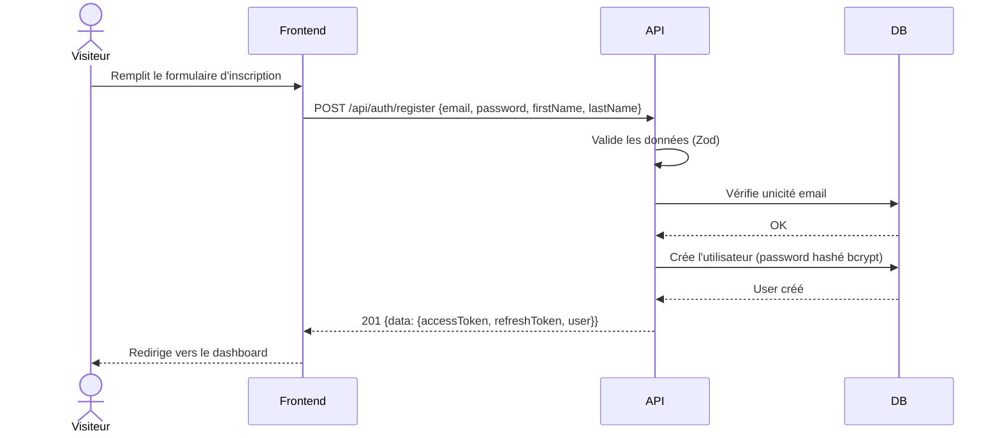
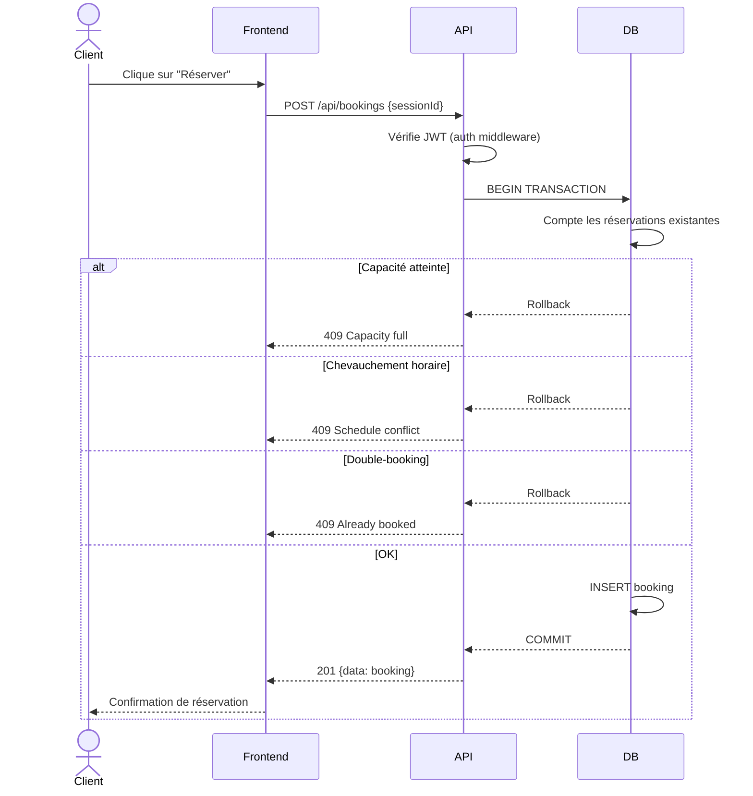
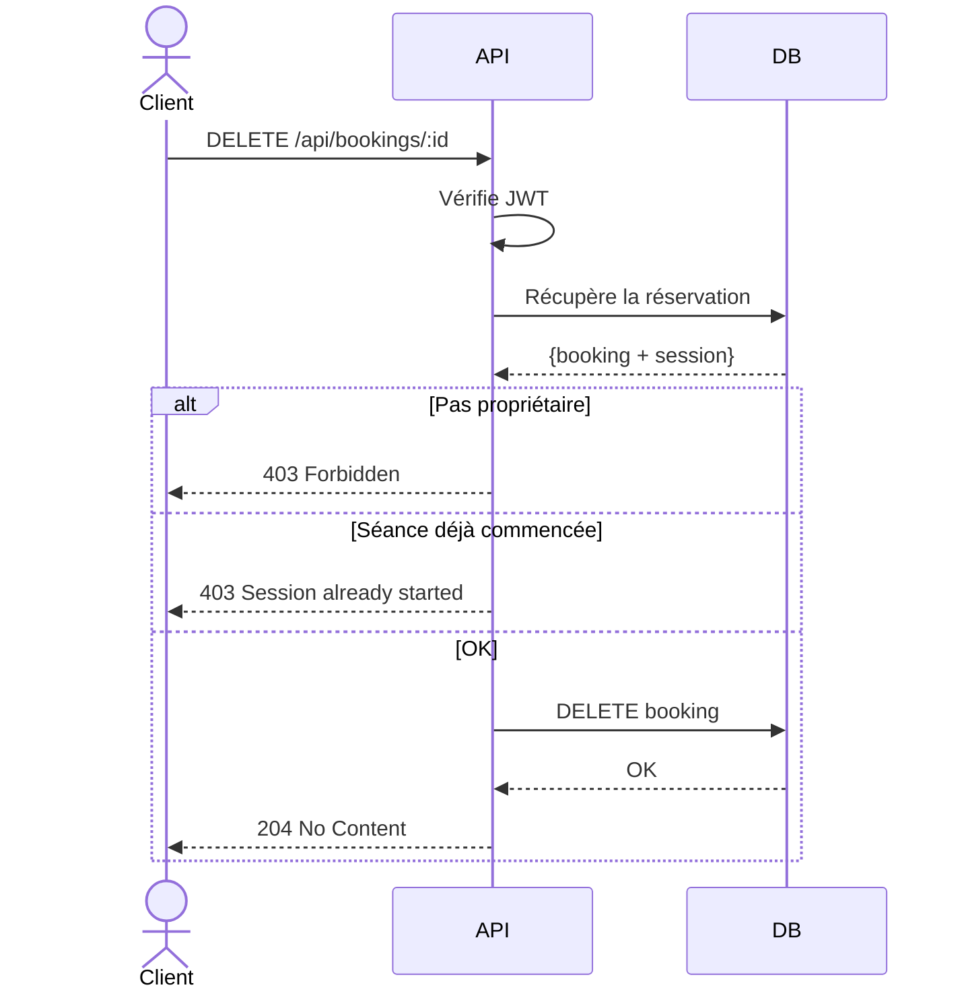
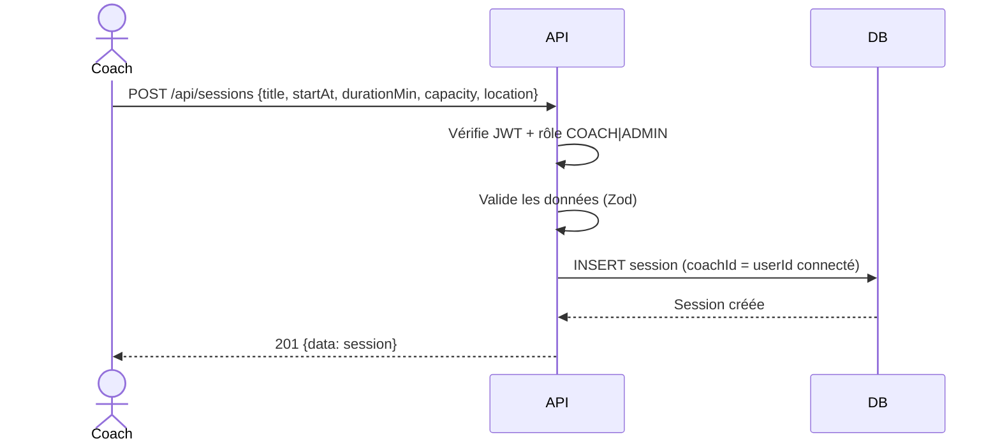

# Cas d'Usage — Sportify Pro

## Diagramme global

```mermaid
graph TD
    Visiteur["👤 Visiteur"]
    Client["👤 Client"]
    Coach["👤 Coach"]
    Admin["👤 Admin"]

    subgraph Authentification
        UC1[S'inscrire]
        UC2[Se connecter]
        UC3[Rafraîchir le token]
        UC4[Voir son profil]
    end

    subgraph "Gestion des séances - Client"
        UC5[Lister les séances]
        UC6[Réserver une séance]
        UC7[Consulter ses réservations]
        UC8[Annuler une réservation]
    end

    subgraph "Gestion des séances - Coach"
        UC9[Consulter son planning]
        UC10[Créer une séance]
        UC11[Modifier une séance]
        UC12[Supprimer une séance]
        UC13[Voir les participants]
    end

    subgraph "Administration"
        UC14[Gérer les utilisateurs]
        UC15[Superviser les séances]
        UC16[Supprimer toute réservation]
    end

    Visiteur --> UC1
    Visiteur --> UC2

    Client --> UC2
    Client --> UC3
    Client --> UC4
    Client --> UC5
    Client --> UC6
    Client --> UC7
    Client --> UC8

    Coach --> UC2
    Coach --> UC3
    Coach --> UC4
    Coach --> UC9
    Coach --> UC10
    Coach --> UC11
    Coach --> UC12
    Coach --> UC13

    Admin --> UC14
    Admin --> UC15
    Admin --> UC16
    Admin --> UC4
    Admin --> UC13
```

## Cas d'usage détaillés

### UC-01 : S'inscrire

### UC-02 : Réserver une séance

### UC-03 : Annuler une réservation

### UC-04 : Créer une séance (Coach)

