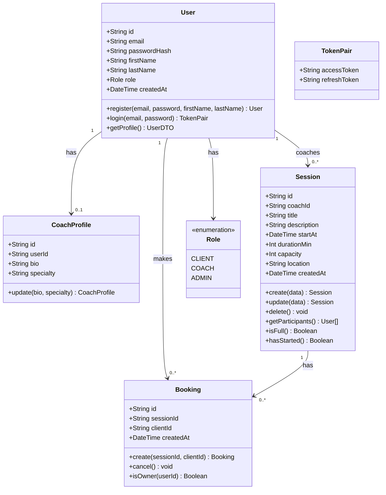

# Diagramme de Classes — Sportify Pro

## Description des classes

### User
Entité principale représentant un utilisateur de la plateforme. Le rôle détermine les droits d'accès.

### CoachProfile
Extension du profil pour les coachs. Contient la biographie et la spécialité sportive du coach.

### Session
Représente une séance de coaching. Appartient à un coach, peut avoir plusieurs réservations jusqu'à sa capacité maximale.

### Booking
Lien entre un client et une séance. Garantit l'unicité (un client ne réserve qu'une fois par séance). La suppression représente l'annulation.

### TokenPair
Objet de valeur retourné lors de l'authentification, contenant le JWT access token et le refresh token.

### Role (enum)
- **CLIENT** : peut réserver des séances
- **COACH** : peut gérer ses propres séances
- **ADMIN** : accès total à toutes les ressources
