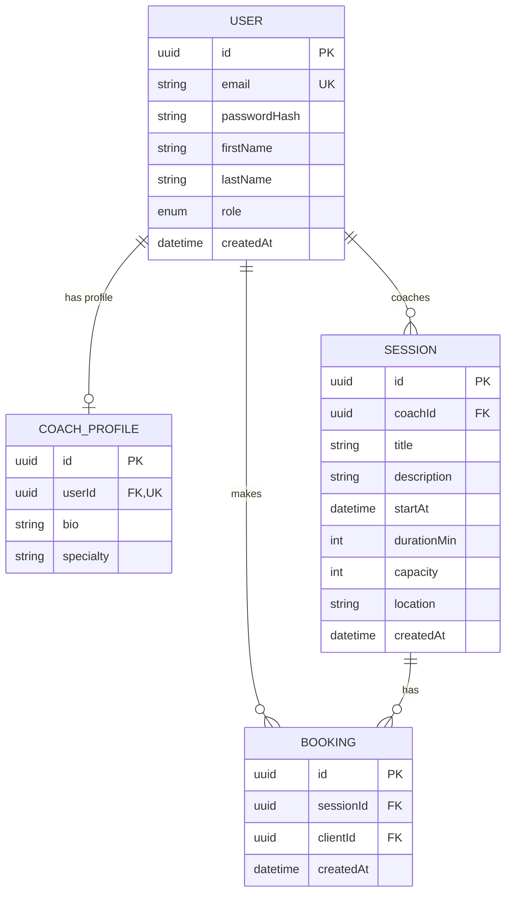

# MCD, MLD et Script SQL — Sportify Pro

## MCD (Modèle Conceptuel de Données)



## MLD (Modèle Logique de Données)

```
USER(id, email*, passwordHash, firstName, lastName, role, createdAt)
  PK: id
  UK: email
  role ∈ {CLIENT, COACH, ADMIN}

COACH_PROFILE(id, userId#, bio, specialty)
  PK: id
  FK: userId → USER(id)
  UK: userId

SESSION(id, coachId#, title, description, startAt, durationMin, capacity, location, createdAt)
  PK: id
  FK: coachId → USER(id)
  INDEX: startAt

BOOKING(id, sessionId#, clientId#, createdAt)
  PK: id
  FK: sessionId → SESSION(id)
  FK: clientId → USER(id)
  UK: (sessionId, clientId)
  INDEX: (clientId, sessionId)
```

## Script SQL

```sql
-- Enum type for user roles
CREATE TYPE "Role" AS ENUM ('CLIENT', 'COACH', 'ADMIN');

-- Users table
CREATE TABLE "User" (
    "id"           UUID         NOT NULL DEFAULT gen_random_uuid(),
    "email"        TEXT         NOT NULL,
    "passwordHash" TEXT         NOT NULL,
    "firstName"    TEXT         NOT NULL,
    "lastName"     TEXT         NOT NULL,
    "role"         "Role"       NOT NULL DEFAULT 'CLIENT',
    "createdAt"    TIMESTAMP(3) NOT NULL DEFAULT CURRENT_TIMESTAMP,

    CONSTRAINT "User_pkey" PRIMARY KEY ("id"),
    CONSTRAINT "User_email_key" UNIQUE ("email")
);

-- Coach profiles table
CREATE TABLE "CoachProfile" (
    "id"        UUID NOT NULL DEFAULT gen_random_uuid(),
    "userId"    UUID NOT NULL,
    "bio"       TEXT,
    "specialty" TEXT,

    CONSTRAINT "CoachProfile_pkey" PRIMARY KEY ("id"),
    CONSTRAINT "CoachProfile_userId_key" UNIQUE ("userId"),
    CONSTRAINT "CoachProfile_userId_fkey" FOREIGN KEY ("userId")
        REFERENCES "User"("id") ON DELETE CASCADE ON UPDATE CASCADE
);

-- Sessions table
CREATE TABLE "Session" (
    "id"          UUID         NOT NULL DEFAULT gen_random_uuid(),
    "coachId"     UUID         NOT NULL,
    "title"       TEXT         NOT NULL,
    "description" TEXT,
    "startAt"     TIMESTAMP(3) NOT NULL,
    "durationMin" INTEGER      NOT NULL,
    "capacity"    INTEGER      NOT NULL,
    "location"    TEXT         NOT NULL,
    "createdAt"   TIMESTAMP(3) NOT NULL DEFAULT CURRENT_TIMESTAMP,

    CONSTRAINT "Session_pkey" PRIMARY KEY ("id"),
    CONSTRAINT "Session_coachId_fkey" FOREIGN KEY ("coachId")
        REFERENCES "User"("id") ON DELETE CASCADE ON UPDATE CASCADE
);

CREATE INDEX "Session_startAt_idx" ON "Session"("startAt");

-- Bookings table
CREATE TABLE "Booking" (
    "id"        UUID         NOT NULL DEFAULT gen_random_uuid(),
    "sessionId" UUID         NOT NULL,
    "clientId"  UUID         NOT NULL,
    "createdAt" TIMESTAMP(3) NOT NULL DEFAULT CURRENT_TIMESTAMP,

    CONSTRAINT "Booking_pkey" PRIMARY KEY ("id"),
    CONSTRAINT "Booking_sessionId_clientId_key" UNIQUE ("sessionId", "clientId"),
    CONSTRAINT "Booking_sessionId_fkey" FOREIGN KEY ("sessionId")
        REFERENCES "Session"("id") ON DELETE CASCADE ON UPDATE CASCADE,
    CONSTRAINT "Booking_clientId_fkey" FOREIGN KEY ("clientId")
        REFERENCES "User"("id") ON DELETE CASCADE ON UPDATE CASCADE
);

CREATE INDEX "Booking_clientId_sessionId_idx" ON "Booking"("clientId", "sessionId");
```
