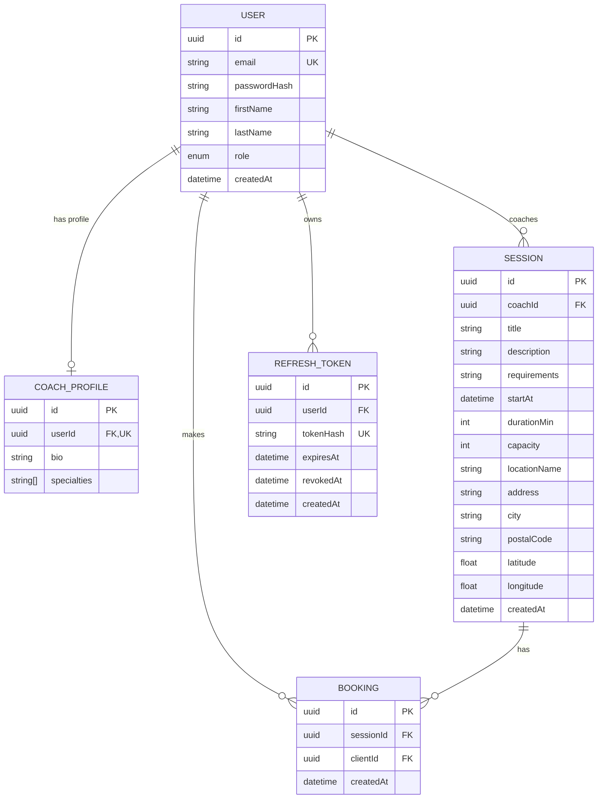

# MCD, MLD et Script SQL — Sportify Pro

## MCD (Modèle Conceptuel de Données)



## MLD (Modèle Logique de Données)

```
USER(id, email*, passwordHash, firstName, lastName, role, createdAt)
  PK: id
  UK: email
  role ∈ {CLIENT, COACH, ADMIN}

COACH_PROFILE(id, userId#, bio, specialties[])
  PK: id
  FK: userId → USER(id) ON DELETE CASCADE
  UK: userId

SESSION(id, coachId#, title, description, requirements, startAt,
        durationMin, capacity, locationName, address, city, postalCode,
        latitude, longitude, createdAt)
  PK: id
  FK: coachId → USER(id) ON DELETE CASCADE
  INDEX: startAt, city

BOOKING(id, sessionId#, clientId#, createdAt)
  PK: id
  FK: sessionId → SESSION(id) ON DELETE CASCADE
  FK: clientId → USER(id) ON DELETE CASCADE
  UK: (sessionId, clientId)
  INDEX: (clientId, sessionId)

REFRESH_TOKEN(id, userId#, tokenHash*, expiresAt, revokedAt, createdAt)
  PK: id
  FK: userId → USER(id) ON DELETE CASCADE
  UK: tokenHash
  INDEX: userId
```

## Script SQL

Voir [script.sql](script.sql) pour le script complet de création reflétant le schéma courant.
