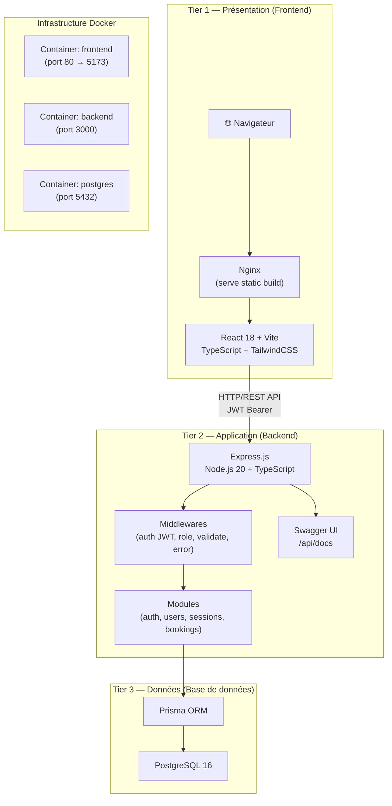
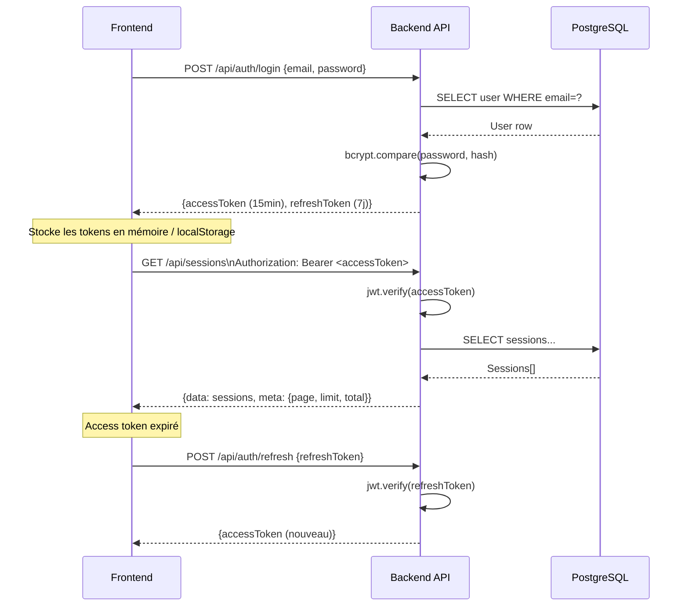
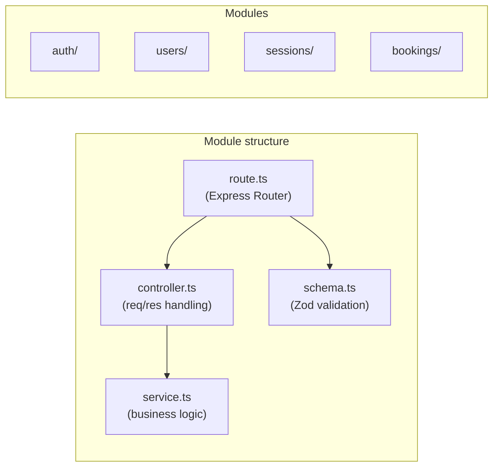
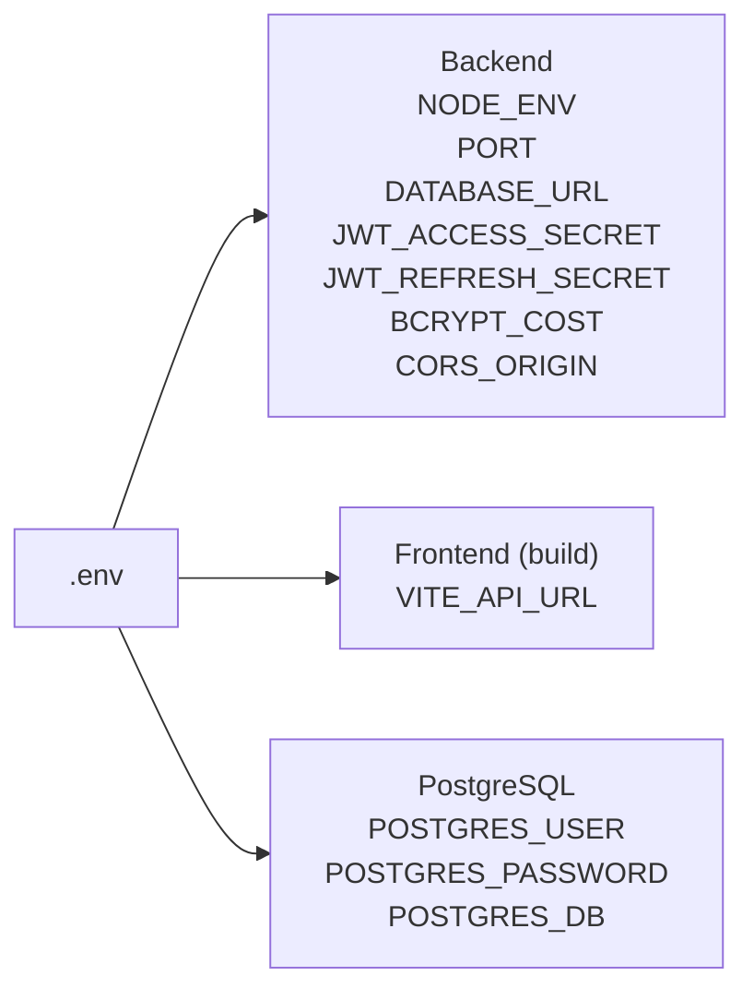

# Architecture — Sportify Pro

## Architecture 3-tiers

```mermaid
graph TB
    subgraph "Tier 1 — Présentation (Frontend)"
        Browser["🌐 Navigateur"]
        React["React 18 + Vite\nTypeScript + TailwindCSS"]
        Nginx["Nginx\n(serve static build)"]
        Browser --> Nginx
        Nginx --> React
    end

    subgraph "Tier 2 — Application (Backend)"
        Express["Express.js\nNode.js 20 + TypeScript"]
        Middlewares["Middlewares\n(auth JWT, role, validate, error)"]
        Modules["Modules\n(auth, users, sessions, bookings)"]
        Swagger["Swagger UI\n/api/docs"]
        Express --> Middlewares
        Middlewares --> Modules
        Express --> Swagger
    end

    subgraph "Tier 3 — Données (Base de données)"
        Prisma["Prisma ORM"]
        PostgreSQL["PostgreSQL 16"]
        Prisma --> PostgreSQL
    end

    React -->|"HTTP/REST API\nJWT Bearer"| Express
    Modules --> Prisma

    subgraph "Infrastructure Docker"
        ContFront["Container: frontend\n(port 80 → 5173)"]
        ContBack["Container: backend\n(port 3000)"]
        ContDB["Container: postgres\n(port 5432)"]
    end
```

## Flux d'authentification

```mermaid
sequenceDiagram
    participant Client as Frontend
    participant API as Backend API
    participant DB as PostgreSQL

    Client->>API: POST /api/auth/login {email, password}
    API->>DB: SELECT user WHERE email=?
    DB-->>API: User row
    API->>API: bcrypt.compare(password, hash)
    API-->>Client: {accessToken (15min), refreshToken (7j)}

    Note over Client: Stocke les tokens en mémoire / localStorage

    Client->>API: GET /api/sessions\nAuthorization: Bearer <accessToken>
    API->>API: jwt.verify(accessToken)
    API->>DB: SELECT sessions...
    DB-->>API: Sessions[]
    API-->>Client: {data: sessions, meta: {page, limit, total}}

    Note over Client: Access token expiré

    Client->>API: POST /api/auth/refresh {refreshToken}
    API->>API: jwt.verify(refreshToken)
    API-->>Client: {accessToken (nouveau)}
```

## Structure des modules backend

```mermaid
graph LR
    subgraph "Module structure"
        Route["route.ts\n(Express Router)"]
        Controller["controller.ts\n(req/res handling)"]
        Service["service.ts\n(business logic)"]
        Schema["schema.ts\n(Zod validation)"]
        Route --> Controller
        Controller --> Service
        Route --> Schema
    end

    subgraph "Modules"
        Auth["auth/"]
        Users["users/"]
        Sessions["sessions/"]
        Bookings["bookings/"]
    end
```

## Variables d'environnement

```mermaid
graph LR
    Env[".env"]
    Backend["Backend\nNODE_ENV\nPORT\nDATABASE_URL\nJWT_ACCESS_SECRET\nJWT_REFRESH_SECRET\nBCRYPT_COST\nCORS_ORIGIN"]
    Frontend["Frontend (build)\nVITE_API_URL"]
    DB["PostgreSQL\nPOSTGRES_USER\nPOSTGRES_PASSWORD\nPOSTGRES_DB"]
    Env --> Backend
    Env --> Frontend
    Env --> DB
```
